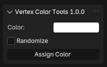

# Vertex Color Tools (Blender Addon)

Vertex Color Tools is a Blender Addon designed to simplify vertex coloring, making it easier to create ID maps for texturing workflows.

## Features

* Assign random or selected vertex colors to multiple objects or specific faces.
* Easy to use interface integrated into the 3D View N-Panel under '5Th-Dimension'.
* Save time while creating ID-Maps.

## Installation

1. Download the [latest release](https://github.com/HoussemEJ/Vertex-Color-Tools/releases/latest) of Vertex Color Tools.

### Method 1: Preferences Install

* In Blender 4.4, go to `Edit -> Preferences -> Add-ons`.
* Click the `Install from disk...` button at the top-right corner.
* Select the downloaded zip file and click `Install from disk`.
* Enable the addon by checking the box next to **Vertex Color Tools**.

### Method 2: Drag-and-Drop

* Simply drag the downloaded zip file into the Blender 3D Viewport.
* Blender will prompt you to install the addon directly.
* Enable it from the pop-up menu or the Preferences window.

The panel will appear in the `N-Panel` under the **5Th-Dimension** category.

## Usage

1. Select one or multiple mesh objects in the 3D Viewport.
2. Open the `N-Panel` under `5Th-Dimension -> Vertex Color Tools`.
3. Choose a color using the **Color Picker** or enable **Randomize** for automatic random colors.
4. Click `Assign Color` to apply vertex colors.

### Behavior:

* If specific faces are selected, the color will only apply to those faces.
* If no faces are selected, the color is applied to the entire mesh.

## Panel Overview

* **Color Picker** - Choose a color for the vertex paint.
* **Randomize** - Apply a random color to each object.
* **Assign Color** - Paint the vertex colors to the selected objects or faces.

## Troubleshooting

* **No mesh objects selected:** Ensure that you have mesh objects selected before applying vertex colors.
* **Not appearing in N-Panel:** Verify the addon is enabled in Preferences.

## Dependencies

* Blender 4.4.0 or newer.
* Supports Windows (x64).

## License

This addon is licensed under [CC BY-NC-SA 4.0](https://creativecommons.org/licenses/by-nc-sa/4.0/)

## Author

Developed by Houssemeddine Jebali.

## Contributing

Pull requests are welcome. For major changes, please open an issue first to discuss what you would like to change.

## Contact

For questions or support, feel free to reach out via GitHub issues.
